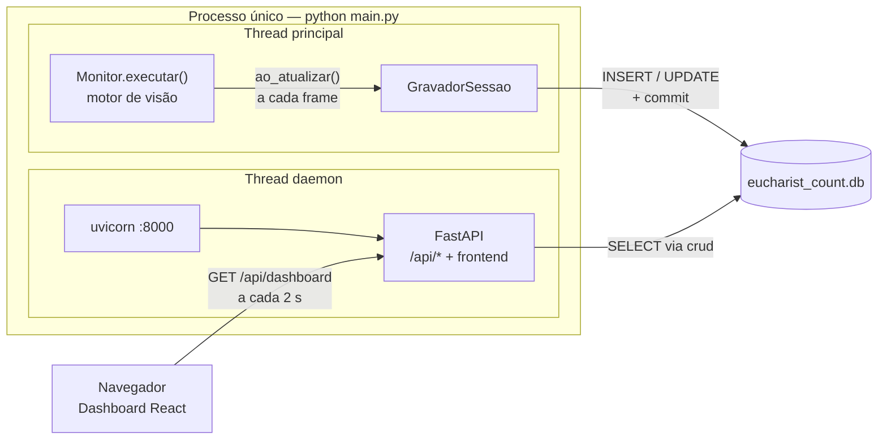
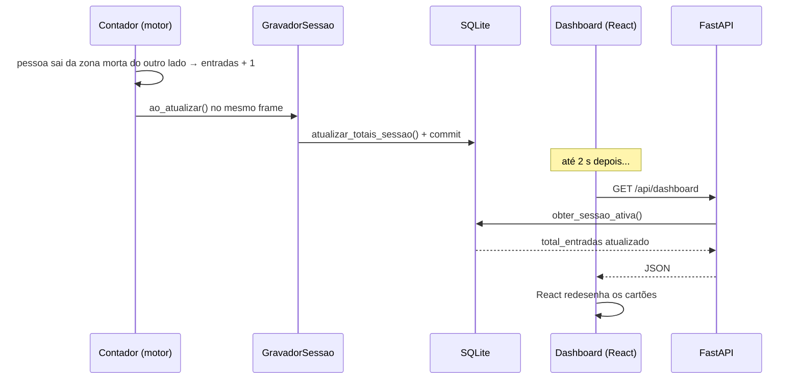

# Documentação Técnica — API e Integração

## Eucharist Count — Backend

Este documento explica **como as peças do backend foram ligadas**: o servidor FastAPI que alimenta o dashboard, a ponte que leva os números do motor de visão até o banco, e o caminho que uma pessoa cruzando o portão percorre até aparecer na tela.

| Documento | Cobre |
|---|---|
| [`DOCUMENTACAO_MOTOR.md`](./DOCUMENTACAO_MOTOR.md) | Motor de visão computacional: câmera, detecção, rastreio e contagem |
| [`DOCUMENTACAO_BANCO.md`](./DOCUMENTACAO_BANCO.md) | Modelo de dados, camada de acesso e estimativa de comunhão |
| **`DOCUMENTACAO_API.md`** (este) | Servidor FastAPI, ligação motor → banco e dashboard ao vivo |

Todo o código descrito aqui está em [`main.py`](./main.py).

---

## 1. Visão geral: um processo, duas threads



Um único comando, `python main.py`, sobe tudo: o motor que conta, o banco que guarda e o servidor que mostra. O objetivo é o mesmo do resto do backend: na máquina da paróquia, ninguém deveria precisar abrir três terminais, e o empacotamento futuro com PyInstaller gera **um único executável**.

As duas partes rodam em threads separadas porque as duas bloqueiam:

- **Thread principal:** o `Monitor` fica preso no loop de frames até o vídeo acabar ou alguém apertar ESC.
- **Thread daemon:** o `uvicorn.run()` fica preso atendendo requisições para sempre. `daemon=True` significa que ela não impede o processo de terminar.

Elas **não compartilham memória** para trocar dados: o motor escreve no banco e a API lê do banco. O banco é a única interface entre as duas, e isso mantém a porta aberta para, no futuro, rodar motor e API em processos (ou máquinas) diferentes sem mudar nenhuma das duas.

---

## 2. A inicialização, passo a passo

O que `main()` faz, em ordem:

| # | Passo | Por quê |
|---|---|---|
| 1 | `multiprocessing.freeze_support()` | Exigência do PyInstaller no Windows: sem isso, o executável empacotado pode abrir cópias de si mesmo em loop |
| 2 | `Config.carregar()` + argumentos de linha de comando | O `config.json` define o padrão; os argumentos sobrescrevem só para aquela execução |
| 3 | `inicializar_banco()` | Cria as tabelas se ainda não existirem (`DOCUMENTACAO_BANCO.md`, seção 6.1) |
| 4 | Sobe a thread do uvicorn | O dashboard fica disponível em `http://127.0.0.1:8000` antes do motor começar |
| 5 | `Monitor(config, RAIZ)` | Carrega o modelo YOLO. **Vem antes de abrir a sessão** (seção 5.5) |
| 6 | Abre conexão, celebração e sessão | `obter_ou_criar_celebracao()` + `iniciar_sessao()` |
| 7 | `monitor.executar(ao_atualizar=gravador)` | Bloqueia até o vídeo acabar |
| 8 | `finalizar_sessao()` no `finally` | Fecha a sessão mesmo com ESC, erro ou Ctrl+C |
| 9 | Imprime o resumo | Entradas, saídas, dentro e FPS médio |

Se o modelo não existir (`FileNotFoundError`) ou a fonte de vídeo não abrir (`RuntimeError`), o programa imprime o erro e sai com código 1.

### 2.1 Argumentos de linha de comando

| Argumento | Sobrescreve | Exemplo |
|---|---|---|
| `--fonte` | `camera.fonte` | `--fonte videos/20-09-teste.mp4` |
| `--modelo` | `deteccao.modelo` | `--modelo modelos/yolo11s_dyn.onnx` |
| `--imgsz` | `deteccao.imgsz` | `--imgsz 640` |
| `--conf` | `deteccao.confianca` | `--conf 0.25` |
| `--fps` | `camera.fps_processamento` | `--fps 5` |
| `--threads` | `deteccao.threads` | `--threads 2` |
| `--linha` | `contagem.linha` | `--linha 0.25,0.0,0.25,1.0` |
| `--sem-janela` | `visual.mostrar_janela = false` | produção, sem interface gráfica |

A configuração efetiva, já com esses argumentos aplicados, é a que fica gravada em `sessao_monitoramento.parametros_contagem`.

---

## 3. Os endpoints

| Método e rota | Devolve | Usado por |
|---|---|---|
| `GET /api/status` | Se há contagem ativa | Selo "Contagem ativa" no topo de todas as páginas (a cada 5 s) |
| `GET /api/dashboard` | Métricas, gráfico e resumo da missa atual | Página Dashboard (a cada 2 s) |
| `GET /api/celebrations` | Celebrações do mês corrente | Ainda não usado (a página Celebrações usa dados fixos) |
| `GET /api/history` | Missas finalizadas | Página Histórico |
| `GET /{qualquer caminho}` | O frontend compilado | O navegador |
| `GET /docs` | Documentação interativa (Swagger) | Desenvolvimento, gerada automaticamente pelo FastAPI |

As respostas são descritas por **modelos Pydantic** (`DashboardOverview`, `Celebration`, `HistoryRecord`…) que espelham, campo a campo e com os mesmos nomes em *camelCase*, as interfaces TypeScript do frontend em `frontend/src/types/`. O FastAPI usa esses modelos para validar e serializar a saída: se uma rota tentar devolver um campo com o tipo errado, o erro aparece no servidor, e não como um bug silencioso na tela.

### 3.1 `GET /api/status`

```json
{ "isCountingActive": true }
```

`true` se existir alguma sessão com `status = 'em_andamento'` (`crud.obter_sessao_ativa`).

### 3.2 `GET /api/dashboard`

Exemplo com uma contagem em andamento:

```json
{
  "metrics": {
    "currentOccupancy": 42,
    "estimatedCommunicants": 32,
    "entries": 50,
    "exits": 8,
    "isCountingActive": true
  },
  "occupancyData": [
    { "time": "21:30", "value": 12 },
    { "time": "21:30", "value": 25 },
    { "time": "21:31", "value": 42 }
  ],
  "celebrationSummary": [
    { "icon": "Church",         "label": "Missa Atual",       "value": "Missa (monitoramento automatico)" },
    { "icon": "ClockArrowUp",   "label": "Início do monitor", "value": "" },
    { "icon": "ClockArrowDown", "label": "Fim do monitor",    "value": "" },
    { "icon": "Users",          "label": "Pessoas presentes", "value": "42 pessoas" }
  ]
}
```

De onde vem cada campo:

| Campo | Origem | Atualizado |
|---|---|---|
| `currentOccupancy` | `sessao_monitoramento.ocupacao_final` | A cada passagem pela linha |
| `entries` / `exits` | `sessao_monitoramento.total_entradas` / `total_saidas` | A cada passagem pela linha |
| `estimatedCommunicants` | `int(ocupação × coeficiente vigente)` (seção 7) | Junto com a ocupação |
| `isCountingActive` | Existe sessão `em_andamento` | Início e fim da sessão |
| `occupancyData[]` | `instantaneo_ocupacao`: `time` = hora de `registrado_em`, `value` = `ocupacao_atual` | A cada 5 s de vídeo |
| `celebrationSummary[]` | `celebracao.titulo`, janela de monitoramento, ocupação | — |

**A ocupação atual vem da sessão, não do último ponto do gráfico.** A sessão é atualizada no instante em que alguém cruza a linha; o gráfico, só a cada 5 segundos de vídeo. Ler a ocupação do último instantâneo deixaria o número principal da tela até 5 segundos atrasado em relação aos cartões de entradas e saídas. O motivo dos dois ritmos está na seção 5.4.

`icon` é o **nome** de um ícone da biblioteca lucide, em texto: o JSON não tem como transportar um componente React. Cabe ao frontend traduzir o nome no componente (seção 9).

Sem sessão ativa, a rota devolve o mesmo formato, zerado, com listas vazias e `isCountingActive: false`. O frontend nunca precisa tratar um formato diferente.

### 3.3 `GET /api/celebrations`

Lista as celebrações do **mês atual** (`crud.listar_celebracoes_do_mes`, que filtra por `data LIKE 'AAAA-MM%'`).

| Campo | Origem |
|---|---|
| `id`, `title` | `celebracao.id`, `titulo` |
| `day`, `weekday` | Derivados de `celebracao.data` |
| `startTime`, `monitorStart`, `monitorEnd` | `horario_missa`, `horario_inicio/fim_monitoramento` |
| `expectedPeople`, `capacity` | `pessoas_esperadas`, `capacidade` (`0` se vazios) |
| `status` | `agendada` → `scheduled`, `em_andamento` → `active`, `finalizada` → `finished` |

O banco usa status em português e o frontend em inglês. A tradução fica na API, em `mapear_status()`, para que nenhum dos dois lados precise conhecer o vocabulário do outro.

### 3.4 `GET /api/history`

Lê a view `vw_historico` (`DOCUMENTACAO_BANCO.md`, seção 3.9), da missa mais recente para a mais antiga.

| Campo | Origem |
|---|---|
| `id` | `sessao_id` |
| `date` | `data` convertida de `2026-09-21` para `21/09/2026` |
| `weekday` | Dia da semana por extenso, derivado da data |
| `celebration`, `startTime` | Título e horário da missa |
| `totalPeople` | `ocupacao_final` |
| `estimatedCommunicants`, `suggestedHosts` | Já priorizados pela view: ajustado → calculado → real |
| `entries`, `exits` | `total_entradas`, `total_saidas` |

### 3.5 Uma conexão por requisição

```python
def obter_db():
    conexao = obter_conexao()
    try:
        yield conexao
    finally:
        conexao.close()

@app.get("/api/status")
def get_status(db: sqlite3.Connection = Depends(obter_db)):
    ...
```

`Depends(obter_db)` é a **injeção de dependência** do FastAPI: antes de cada requisição, ele executa `obter_db()` até o `yield` e entrega a conexão para a rota; depois da resposta, executa o `finally` e fecha a conexão. Cada requisição tem sua própria conexão, e nenhuma fica aberta esquecida, mesmo se a rota lançar exceção.

As rotas são funções comuns (`def`), não `async def`. O FastAPI roda funções comuns num pool de threads, o que é o certo aqui: o `sqlite3` é bloqueante, e uma consulta dentro de `async def` travaria o servidor inteiro enquanto esperasse o disco.

---

## 4. Servindo o frontend

A mesma porta 8000 serve a API **e** o dashboard compilado. Não é preciso um servidor web separado para o React.

```python
@app.get("/{catchall:path}")
def serve_frontend_spa(catchall: str): ...
```

A regra, na ordem:

1. Se o caminho pedido é um arquivo que existe em `frontend/dist/` (um `.js`, `.css`, imagem), devolve o arquivo.
2. Se `frontend/dist/index.html` não existe, devolve um aviso pedindo `npm run build`.
3. Senão, devolve o `index.html`.

O passo 3 é o que faz as rotas do React funcionarem ao recarregar a página. `/historico` não é um arquivo, mas uma tela que o React desenha no navegador; sem essa regra, apertar F5 em `/historico` daria 404.

**A ordem de declaração importa.** O FastAPI testa as rotas na ordem em que foram declaradas, e `/{catchall:path}` aceita qualquer caminho. Por isso ele é declarado **depois** de todas as rotas `/api/*`: se viesse antes, capturaria também as chamadas da API.

**O frontend precisa estar compilado.** O `main.py` serve a pasta `dist/`, e não o código-fonte React. Mudanças no frontend só aparecem em `:8000` depois de `npm run build` na pasta `frontend`. Durante o desenvolvimento, `npm run dev` serve o frontend com recarga automática em outra porta (5173), consumindo a API em `:8000`.

**Onde fica `dist/`:** em desenvolvimento, em `frontend/dist` na raiz do repositório. No executável do PyInstaller, os arquivos são extraídos numa pasta temporária indicada por `sys._MEIPASS`, e o `main.py` escolhe entre as duas com `getattr(sys, 'frozen', False)`.

**CORS:** no modo de desenvolvimento, o frontend (`:5173`) e a API (`:8000`) estão em portas diferentes, o que o navegador trata como origens diferentes e bloqueia por padrão. O `CORSMiddleware` com `allow_origins=["*"]` libera. Quando o dashboard é servido pelo próprio `main.py`, tudo vem da mesma origem e o CORS nem entra em jogo.

---

## 5. A ligação motor → banco

### 5.1 O problema

Os números nascem dentro do loop do `Monitor`, frame a frame. Eles precisam chegar ao banco **enquanto a missa acontece**, para o dashboard mostrar a contagem ao vivo. O jeito mais direto seria chamar `crud.registrar_instantaneo(...)` dentro do `monitor.py`, mas isso quebraria o princípio central do motor (`DOCUMENTACAO_MOTOR.md`, seção 11): cada módulo não sabe nada dos outros. O motor passaria a depender do banco, e deixaria de ser testável sem um.

### 5.2 A solução: um callback

O `Monitor` ganhou um único parâmetro opcional:

```python
def executar(self, ao_atualizar: Callable[[Metricas, float], None] | None = None) -> Metricas:
    ...
    self._atualizar_metricas(pessoas, ultimo_instante)
    if ao_atualizar is not None:
        ao_atualizar(self.metricas, fonte.tempo_atual)
```

A cada frame processado, o motor chama a função recebida com duas coisas: as métricas atuais e o instante do frame **no tempo do vídeo**. O motor não sabe quem está ouvindo nem o que será feito com isso. Continua sem importar nada de `db/`.

Como o parâmetro é opcional, quem chama `executar()` sem argumento, como os scripts de calibração, continua funcionando igual.

### 5.3 O `GravadorSessao`

Quem escuta é o `GravadorSessao`, em `main.py`. É uma classe com o método especial `__call__`, o que permite passar o objeto onde se espera uma função. A vantagem sobre uma função comum é que o objeto **guarda estado entre uma chamada e outra**:

| Atributo | Guarda |
|---|---|
| `_ultimo` | O instante do último instantâneo gravado. Começa em `-math.inf`, para o primeiro frame sempre gravar |
| `_totais` | O par `(entradas, saídas)` da última gravação dos totais |
| `pico` | A maior ocupação já vista, conferida em **todo** frame |

```python
def __call__(self, metricas, instante):
    self.pico = max(self.pico, metricas.dentro)

    totais = (metricas.entradas, metricas.saidas)
    if totais != self._totais:                    # alguém cruzou a linha
        self._totais = totais
        crud.atualizar_totais_sessao(...)          # grava na hora

    if instante - self._ultimo < self.intervalo:  # ainda não deu 5 s
        return
    self._ultimo = instante
    crud.registrar_instantaneo(...)                # um ponto no gráfico
```

### 5.4 Dois ritmos de escrita

O gravador faz duas escritas diferentes, em ritmos diferentes, porque elas servem a leitores diferentes:

| Escrita | Ritmo | Serve a | Por quê |
|---|---|---|---|
| Totais da sessão | **No frame em que alguém cruza a linha** | Cartões de ocupação, entradas e saídas | Quem olha o painel espera ver o número mudar quando a pessoa passa |
| Instantâneo | **A cada 5 segundos de vídeo** | Gráfico "Evolução da ocupação" | Uma curva precisa de pontos regulares, não de um ponto por frame |

**Por que os totais não saem caros:** o motor chama o gravador 7,5 vezes por segundo, mas pessoas cruzando a linha são raras em comparação. Na imensa maioria dos frames, `(entradas, saídas)` não mudou e o gravador nem toca no banco.

**Por que 5 segundos para o gráfico:** gravar a cada frame daria ~27.000 linhas por hora de missa, com um `commit()` em disco a cada uma, disputando CPU com a detecção e travando por instantes as leituras da API. Com 5 segundos, são 720 linhas por hora, o suficiente para desenhar a curva com folga. O valor começou em 10 segundos e foi reduzido para 5 para o gráfico parecer mais "ao vivo". A justificativa completa, com a comparação entre intervalos e o motivo de não gravar só no final, está em `DOCUMENTACAO_BANCO.md`, seção 7.3. Para mudar, basta um argumento: `GravadorSessao(conexao, sessao_id, intervalo=5.0)`.

**Por que segundos de vídeo:** o intervalo é medido com `fonte.tempo_atual`, e não com o relógio da máquina, pelo mesmo motivo que o cooldown da contagem (`DOCUMENTACAO_MOTOR.md`, seção 8.8): o mesmo vídeo de teste gera sempre os mesmos pontos, independentemente da velocidade do computador. Numa câmera ao vivo, os dois relógios coincidem.

### 5.5 Abrindo e fechando a sessão

```python
monitor = Monitor(config, RAIZ)                  # 1. carrega o modelo

conexao = obter_conexao()
celebracao_id = crud.obter_ou_criar_celebracao(...)
sessao_id = crud.iniciar_sessao(...)             # 2. abre a sessão
gravador = GravadorSessao(conexao, sessao_id)
try:
    metricas = monitor.executar(ao_atualizar=gravador)
finally:
    crud.finalizar_sessao(...)                   # 3. fecha, aconteça o que acontecer
    conexao.close()
```

Três decisões nesse trecho:

- **O `Monitor` é criado antes de abrir a sessão.** Se o modelo não existir, o erro acontece antes de qualquer escrita, e não fica uma sessão vazia no banco.
- **O `finally` garante o fechamento.** Sem ele, sair com ESC ou Ctrl+C deixaria a sessão `em_andamento` para sempre, e o dashboard mostraria uma "contagem ativa" fantasma em toda execução futura.
- **Uma conexão para a missa inteira.** O motor abre uma conexão e a mantém até o fim, ao contrário da API, que abre uma por requisição (`DOCUMENTACAO_BANCO.md`, seção 7.5).

**Qual celebração é usada:** enquanto o agendamento automático não existe (seção 8), a celebração é criada na hora, com a data e o horário em que o programa foi iniciado e o título "Missa (monitoramento automatico)". Reiniciar o programa no mesmo minuto reaproveita a celebração e cria uma segunda sessão nela; reiniciar num minuto diferente cria uma celebração nova.

---

## 6. O dashboard ao vivo

### 6.1 O caminho de uma pessoa até a tela



O atraso entre a pessoa ser contada e o número mudar na tela é de **no máximo cerca de 2 segundos**: a gravação acontece no mesmo frame da contagem, e o atraso restante é o intervalo de consulta do navegador.

### 6.2 Consulta repetida (*polling*)

O frontend busca `/api/dashboard` a cada 2 segundos (`frontend/src/hooks/useDashboardData.ts`, constante `INTERVALO_ATUALIZACAO_MS`). O selo de status no topo das páginas faz o mesmo com `/api/status`, a cada 5 segundos.

A alternativa seria o servidor **empurrar** os dados para o navegador, por WebSocket ou *Server-Sent Events*. A consulta repetida foi escolhida porque, neste cenário, as vantagens do *push* não compensam a complexidade:

- **A carga é irrelevante.** Há um navegador, na mesma máquina, fazendo uma consulta leve a cada 2 segundos.
- **Recuperação automática.** Se a API cair e voltar, a próxima consulta simplesmente funciona. Com WebSocket, seria preciso programar a detecção da queda e a reconexão.
- **2 segundos já parece instantâneo** para um painel de ocupação. Se for preciso mais rápido, basta mudar a constante.
- **O banco continua sendo a única interface.** Com *push*, a API teria que ser avisada pelo motor de cada mudança, o que acoplaria as duas threads.

Se a API não responder, o hook **mantém na tela os últimos dados recebidos** e tenta de novo no ciclo seguinte. Antes da primeira resposta, a tela mostra tudo zerado. Os valores iniciais (`frontend/src/data/dashboardMock.ts`) foram zerados justamente para que números de demonstração nunca apareçam como se fossem uma contagem real.

---

## 7. A estimativa de comunhão na API

A rota do dashboard calcula a estimativa assim:

```python
config_est = crud.obter_configuracao_estimativa_vigente(db)
coef = config_est["coeficiente_comunhao"] if config_est else 0.4
estimated_comm = int(latest_occupancy * coef)
```

O coeficiente vem da versão mais recente de `configuracao_estimativa`, gravada por `calcular_coeficiente_inicial.py` (`DOCUMENTACAO_BANCO.md`, seção 9). Com os dados atuais, ele vale cerca de 0,78.

O restante da conta é feito no frontend (`CommunionEstimate.tsx`): as hóstias sugeridas são `⌈estimativa × 1,1⌉`, e a porcentagem é `estimativa ÷ ocupação`.

Essa implementação cobre só a fase de coeficiente fixo. O contrato completo descrito em `DOCUMENTACAO_BANCO.md` (carregar o modelo `.joblib` quando `metodo = 'regressao'`, aplicar a `margem_hostias` do banco) ainda não está implementado. Ver seção 9.

---

## 8. Próximos passos previstos

- **Agendamento automático (APScheduler).** O `main.py` tem, comentado, o esqueleto de um agendador que iniciaria o monitoramento sozinho no horário de cada missa, sem janela. Com ele, a celebração deixaria de ser criada na hora (seção 5.5) e passaria a vir da agenda (`horario_padrao`). O `Monitor.parar()` já existe para o agendador encerrar a contagem no fim da janela.
- **Empacotamento (PyInstaller).** O código já prevê o executável: `freeze_support()` e a resolução de caminhos por `sys._MEIPASS`.
- **Botões de iniciar e encerrar contagem.** Existem no dashboard, mas hoje só escrevem no console do navegador. Não há rotas na API para controlar o motor.

---

## 9. Limitações conhecidas

Pontos identificados em revisão e ainda não corrigidos no código:

| Onde | Limitação | Efeito |
|---|---|---|
| `main()` | O motor bloqueia a thread principal, e a API é uma thread daemon | Quando o vídeo termina, o processo encerra e o dashboard sai do ar junto, justamente quando os números finais existem |
| `/api/dashboard` | A hora do gráfico é o texto de `registrado_em`, que está em UTC | O eixo do gráfico aparece 3 horas adiantado no Brasil |
| `/api/dashboard` | Só a primeira linha do resumo trata celebração inexistente (`if celebracao else`) | Se a sessão ativa apontar para uma celebração removida, a rota lança `TypeError` |
| `/api/dashboard` | Coeficiente reserva fixo em `0.4` quando não há configuração | Estima metade do valor observado (~0,78). Um número plausível e errado é pior que nenhum |
| `CelebrationSummary.tsx` | Renderiza `<item.icon />`, mas a API manda o nome do ícone em texto | Os ícones do resumo não aparecem. Falta um mapa nome → componente no frontend |
| `/{catchall:path}` | Também responde a `/api/*` inexistentes | Uma rota errada devolve `200` com HTML, e o frontend vê um erro de leitura de JSON em vez de um 404 |
| `mapear_status()` | `cancelada` não está no mapa | Celebrações canceladas aparecem como `scheduled` |
| `uvicorn.run(host="0.0.0.0")` | Escuta em todas as interfaces de rede | O dashboard fica acessível para qualquer máquina da rede da paróquia, sem autenticação. Para uso só local, `host="127.0.0.1"` |
| `aplicar_argumentos()` | `if args.conf` / `if args.threads` tratam `0` como "não informado" | `--threads 0` não é aplicado |
| `main()` (`finally`) | Sempre fecha a sessão como `concluida` | Uma execução que falhou entra no histórico como contagem válida com zeros |
| Motor | `Config.caminho_absoluto()` converte `rtsp://` e `0` em caminhos de arquivo | `--fonte` com câmera IP ou webcam não funciona. Ver `DOCUMENTACAO_MOTOR.md`, seção 14 |
