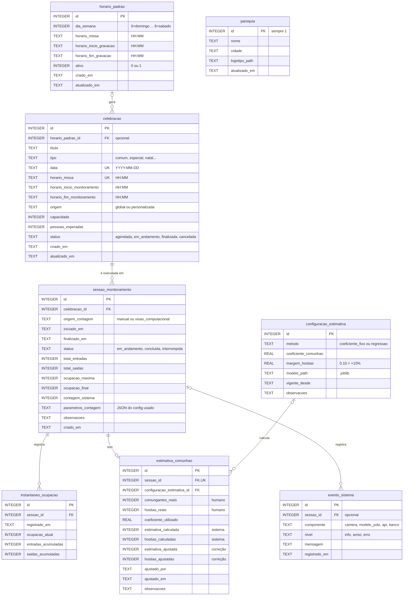
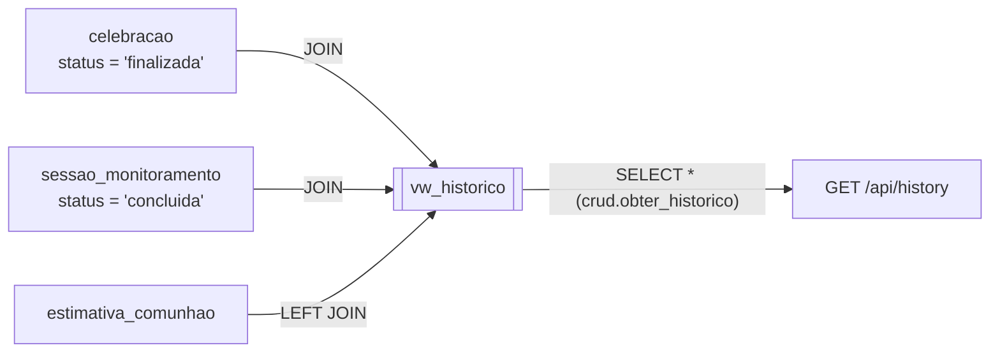
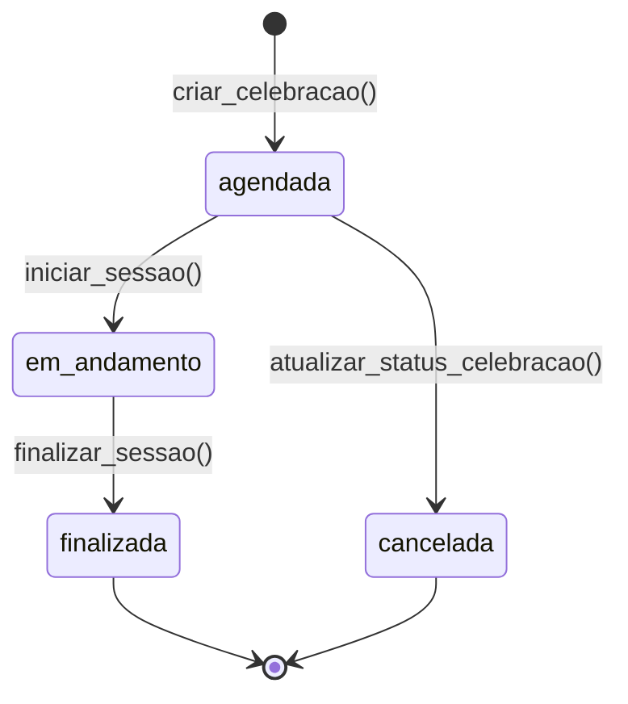
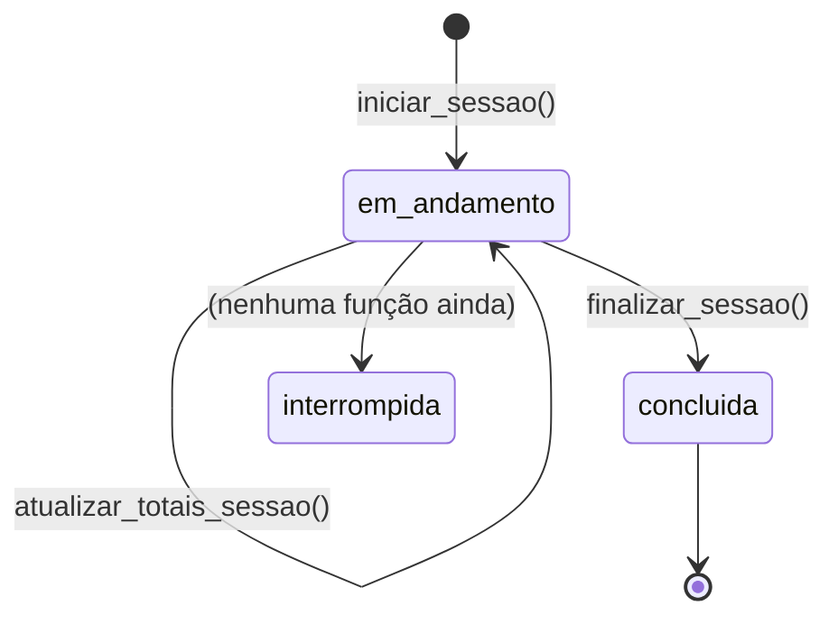
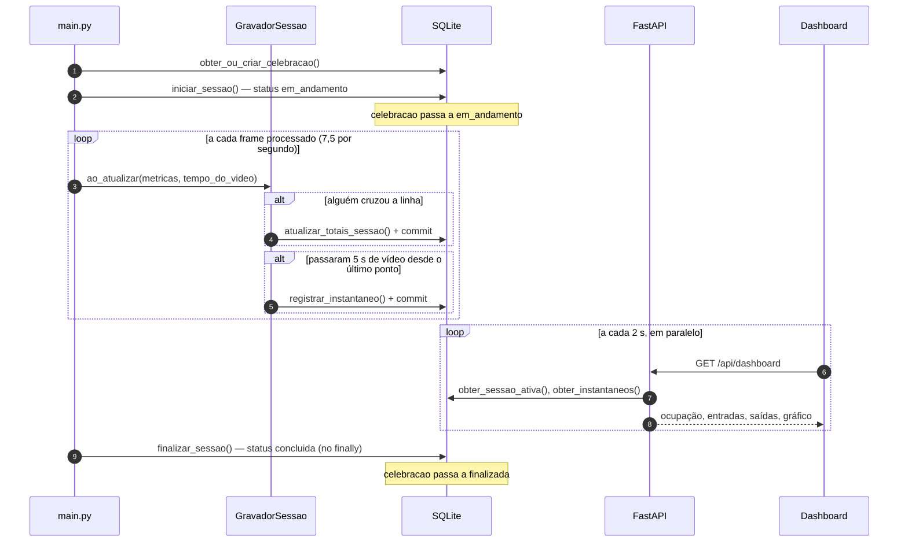
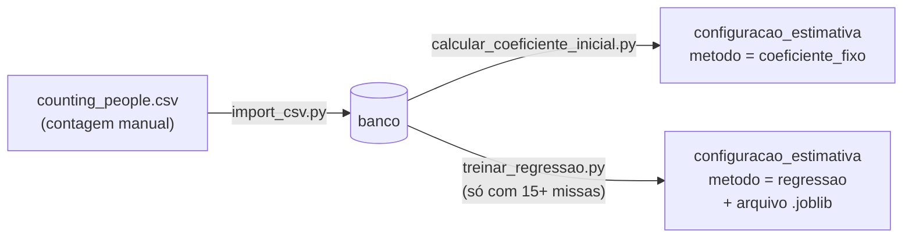

# Documentação Técnica — Banco de Dados

## Eucharist Count — Backend

Este documento explica **como o banco de dados está organizado e por quê**: o papel de cada tabela, as regras que o próprio banco garante, e como os números produzidos pelo motor de visão chegam até ele durante uma celebração.

Ele faz parte de um conjunto de três documentos:

| Documento | Cobre |
|---|---|
| [`DOCUMENTACAO_MOTOR.md`](./DOCUMENTACAO_MOTOR.md) | Motor de visão computacional: câmera, detecção, rastreio e contagem |
| **`DOCUMENTACAO_BANCO.md`** (este) | Modelo de dados, camada de acesso e estimativa de comunhão |
| [`DOCUMENTACAO_API.md`](./DOCUMENTACAO_API.md) | Servidor FastAPI, ligação motor → banco e dashboard ao vivo |

Para um guia rápido de uso (comandos, exemplos curtos), veja [`db/README.md`](./db/README.md).

---

## 1. Por que SQLite

O banco é **SQLite**: um único arquivo, `backend/db/eucharist_count.db`, lido e escrito direto pelo Python. A escolha decorre do mesmo requisito que guia o resto do backend — rodar numa máquina comum de paróquia, sem nuvem e sem ninguém de TI por perto:

- **Não existe servidor.** Não há um serviço de banco para instalar, iniciar, atualizar ou que possa cair. O backup é copiar um arquivo.
- **Vem com o Python.** O módulo `sqlite3` é da biblioteca padrão: nenhuma dependência nova no executável.
- **O volume é pequeno.** Uma celebração gera algumas centenas de linhas (seção 7.3). É uma carga trivial para o SQLite.
- **Um escritor por vez é suficiente.** O SQLite só permite uma escrita simultânea. Aqui, durante a missa, só o motor escreve; a API apenas lê.

Também não há ORM (SQLAlchemy ou similar), de propósito: o schema é pequeno, o SQLite já fala SQL diretamente e isso evita mais uma dependência pesada. Toda a estrutura está num arquivo só, [`db/schema.sql`](./db/schema.sql), que é a fonte da verdade.

### 1.1 O que muda para quem já conhece SQL

A linguagem SQL é a mesma. O que muda é a forma como o Python conversa com o banco:

| Conceito | Como funciona aqui |
|---|---|
| Conexão | `sqlite3.connect("caminho.db")`. Não tem host, usuário nem senha. No projeto, sempre via `obter_conexao()` |
| Parâmetros | Marcador `?` e os valores numa tupla: `execute("... WHERE id = ?", (5,))`. Nunca montar SQL com f-string |
| Resultado | `.fetchone()` devolve uma linha ou `None`; `.fetchall()` devolve uma lista |
| Transação | O Python abre a transação sozinho antes de um `INSERT`/`UPDATE`. **Sem `commit()`, nenhuma outra conexão vê o que foi gravado** |
| ID gerado | `cursor.lastrowid` depois do `INSERT` |
| Chaves estrangeiras | **Desligadas por padrão**, e precisam ser ligadas em toda conexão com `PRAGMA foreign_keys = ON` |
| Datas | Não existe tipo de data. Tudo é `TEXT` em ISO-8601 (`'2026-09-24'`), que ordena e compara corretamente como texto |

---

## 2. O modelo de dados



> O diagrama usa [Mermaid](https://mermaid.js.org/), que o GitHub desenha automaticamente. No VS Code, instale a extensão *Markdown Preview Mermaid Support* para vê-lo na pré-visualização.

**Como ler as ligações:** `||--o{` é "um para muitos", `||--o|` é "um para zero ou um", e `|o--o{` indica que o lado "um" é opcional (a chave estrangeira aceita `NULL`).

### 2.1 A ideia central: planejado × executado

O modelo separa **o que estava agendado** do **que de fato aconteceu**:

```
PLANEJADO                                   EXECUTADO

horario_padrao ──gera──▶ celebracao ──1:N──▶ sessao_monitoramento ──1:N──▶ instantaneo_ocupacao
(agenda semanal)         (uma missa          (uma execução            │     (série do gráfico)
                          numa data)          real da contagem)       │
                                                                      └─1:1─▶ estimativa_comunhao
                                                                              (comungantes e hóstias)
```

`celebracao` é a missa na agenda; `sessao_monitoramento` é uma rodada de contagem dessa missa. Elas são tabelas diferentes porque **uma celebração pode ter mais de uma sessão**: se a energia cair ou a máquina travar no meio da missa, o monitoramento reinicia e cada tentativa vira uma sessão própria, sem apagar a anterior.

A mesma separação permite que a contagem manual de hoje (o "olhômetro", importado da planilha) e a contagem por câmera escrevam **na mesma tabela**, distinguidas só pela coluna `origem_contagem`. Nenhuma tabela nova foi necessária quando o motor passou a gravar.

---

## 3. As tabelas, uma a uma

### 3.1 `paroquia`

Identidade da paróquia exibida no menu lateral (nome, cidade, logotipo). É uma **tabela de linha única**: `CHECK (id = 1)` impede uma segunda linha, e `crud.definir_paroquia()` usa `INSERT ... ON CONFLICT(id) DO UPDATE` para criar ou atualizar sempre o registro 1. Ainda não é usada pela API.

### 3.2 `horario_padrao`

A agenda semanal fixa (tela Configurações): cada linha é uma missa recorrente num dia da semana, com a janela de gravação associada.

- `dia_semana` segue a convenção **0 = domingo … 6 = sábado**, travada por `CHECK (dia_semana BETWEEN 0 AND 6)`. Atenção: o Python usa segunda = 0; a conversão está em `preparar_dataset._dia_semana()`.
- Remover um horário não apaga a linha: `crud.remover_horario_padrao()` faz `ativo = 0` (*soft delete*), para que celebrações antigas geradas a partir dele não percam a referência.

Ainda não é usada pela API nem pelo motor. A tela de Configurações está em construção.

### 3.3 `celebracao`

Uma data concreta com missa.

| Coluna | Regra | Para que serve |
|---|---|---|
| `horario_padrao_id` | FK opcional, `ON DELETE SET NULL` | De qual horário fixo ela veio. `NULL` para celebrações avulsas (Natal, missa especial) |
| `titulo`, `tipo` | `tipo` padrão `'comum'` | Nome exibido e categoria (usada como variável na regressão, seção 9) |
| `data`, `horario_missa` | **`UNIQUE (data, horario_missa)`** | Impede duas missas no mesmo dia e horário |
| `horario_inicio/fim_monitoramento` | opcionais | Janela em que a câmera deve contar. Vazios em registros só manuais |
| `origem` | `CHECK IN ('global', 'personalizada')` | Gerada da agenda ou cadastrada à mão. Espelha `source` no frontend |
| `capacidade`, `pessoas_esperadas` | opcionais | Planejamento |
| `status` | ver seção 5 | Onde a missa está no seu ciclo de vida |

`atualizado_em` é mantido por um gatilho (seção 4.3).

### 3.4 `sessao_monitoramento`

**A tabela central do sistema**: uma execução real da contagem para uma celebração.

| Coluna | Regra | Para que serve |
|---|---|---|
| `celebracao_id` | FK **obrigatória**, `ON DELETE CASCADE` | A missa contada. Não existe sessão sem celebração |
| `origem_contagem` | `CHECK IN ('manual', 'visao_computacional')` | Quem contou: a equipe (planilha) ou o motor |
| `iniciado_em`, `finalizado_em` | UTC (seção 8) | Início e fim da sessão |
| `status` | ver seção 5 | `em_andamento` enquanto a câmera conta |
| `total_entradas`, `total_saidas` | padrão 0 | Acumulados. **Atualizados a cada passagem pela linha** durante a missa (seção 7.4) |
| `ocupacao_maxima` | padrão 0 | Pico de pessoas dentro da igreja durante a sessão |
| `ocupacao_final` | padrão 0 | **A contagem oficial.** Hoje é o que o motor contou; se a equipe digitar a contagem manual depois, ela prevalece aqui |
| `contagem_sistema` | opcional | **A contagem automática**, preservada mesmo que `ocupacao_final` seja corrigida. É a comparação entre as duas que mede a acurácia do motor |
| `parametros_contagem` | JSON | Cópia completa da configuração usada (modelo, `imgsz`, linha, margem…) |
| `observacoes` | texto livre | Ex.: "chuva forte", "câmera reiniciada" |

**Por que guardar `parametros_contagem`:** a contagem depende de parâmetros ajustáveis, como posição da linha, margem e confiança (ver `DOCUMENTACAO_MOTOR.md`, seção 7.2). Guardar a configuração exata junto de cada sessão torna cada número **auditável e reproduzível**: é possível saber, meses depois, com que ajuste uma contagem antiga foi feita, e rodar o mesmo vídeo com os mesmos parâmetros para conferir. O motor grava ali `json.dumps(asdict(config))`, um retrato de todo o `config.json` efetivo, já com os argumentos de linha de comando aplicados.

### 3.5 `instantaneo_ocupacao`

A **série temporal** da ocupação dentro de uma sessão, que desenha o gráfico "Evolução da ocupação" do dashboard. Cada linha é uma fotografia numérica: quantas pessoas estavam dentro, e quantas tinham entrado e saído até aquele momento.

O motor grava uma linha **a cada 5 segundos de vídeo**. A justificativa desse intervalo está na seção 7.3.

O índice `idx_instantaneo_sessao_tempo (sessao_id, registrado_em)` cobre exatamente a consulta do gráfico: "todos os instantâneos desta sessão, em ordem de tempo".

### 3.6 `configuracao_estimativa`

Os parâmetros que convertem ocupação em estimativa de comungantes e de hóstias.

| Coluna | Para que serve |
|---|---|
| `metodo` | `'coeficiente_fixo'` (fase atual) ou `'regressao'` (quando houver dados suficientes, seção 9) |
| `coeficiente_comunhao` | Fração dos presentes que costuma comungar. **Obrigatório mesmo no modo regressão**, onde serve de reserva se o modelo não puder prever |
| `margem_hostias` | Folga sobre a estimativa. `0.10` = consagrar 10% a mais |
| `modelo_path` | Caminho do modelo treinado (`.joblib`), relativo a `db/` |
| `vigente_desde` | Quando essa versão passou a valer |

**É uma tabela *append-only*:** para mudar o coeficiente, insere-se uma linha nova em vez de fazer `UPDATE`. A versão vigente é sempre a mais recente. Isso preserva o histórico: dá para saber qual coeficiente valia quando cada sessão antiga foi estimada, e a coluna `estimativa_comunhao.configuracao_estimativa_id` aponta exatamente para ele.

### 3.7 `estimativa_comunhao`

Uma linha por sessão (`sessao_id` é `UNIQUE`), com **três fontes de valor lado a lado, de propósito**:

| Fonte | Colunas | Quem preenche |
|---|---|---|
| **Real** | `comungantes_reais`, `hostias_reais` | A equipe, contando na missa. É a "verdade" contra a qual o sistema é medido. Hoje é a única preenchida (vem da planilha) |
| **Calculada** | `estimativa_calculada`, `hostias_calculadas`, `coeficiente_utilizado` | O sistema, pelo coeficiente ou pela regressão |
| **Ajustada** | `estimativa_ajustada`, `hostias_ajustadas`, `ajustado_por`, `ajustado_em` | O ministro, corrigindo o valor calculado antes da missa |

Guardar as três separadas, em vez de sobrescrever uma com a outra, é o que sustenta o fluxo *human-in-the-loop* descrito no TCC. Permite medir **real × calculado** (a acurácia do modelo) e **real × ajustado** (o quanto a correção humana ainda é necessária). E as correções humanas acumuladas são justamente o dado que alimenta o treino futuro da regressão.

`crud.registrar_estimativa()` grava com `INSERT ... ON CONFLICT(sessao_id) DO UPDATE SET coluna = COALESCE(novo, atual)`: cria a linha se não existir, e numa atualização **só sobrescreve os campos informados**. Assim, o registro manual de `comungantes_reais` e o cálculo automático podem acontecer em momentos diferentes sem um apagar o outro.

### 3.8 `evento_sistema`

Um log leve de saúde e operação (câmera, modelo, reconexões, erros), pensado para alimentar a seção "Saúde do sistema" com dados reais em vez de valores fixos na tela. A tabela e as funções (`registrar_evento_sistema`, `ultimo_evento_por_componente`) existem, mas **ainda não são usadas** pelo motor nem pela API.

### 3.9 `vw_historico` (view)

Uma consulta salva que entrega a tela **Histórico** já pronta, sem nenhum `JOIN` na API:



Duas decisões merecem destaque:

- **`LEFT JOIN` na estimativa:** uma missa contada, mas ainda sem estimativa registrada, aparece no histórico com a estimativa vazia, em vez de sumir.
- **Prioridade por `COALESCE`:**

  ```sql
  COALESCE(e.estimativa_ajustada, e.estimativa_calculada, e.comungantes_reais) AS estimativa_comunhao
  COALESCE(e.hostias_ajustadas,   e.hostias_calculadas,   e.hostias_reais)     AS hostias_sugeridas
  ```

  `COALESCE` devolve o primeiro valor não nulo. A tela mostra a correção humana se ela existir; senão, o cálculo do sistema; senão, a contagem real. É a tradução em SQL da regra "o ajuste do ministro tem a palavra final".

---

## 4. As regras que o próprio banco garante

Regras colocadas no schema valem para qualquer código que escreva no banco: API, motor, scripts ou alguém editando à mão.

### 4.1 Restrições

| Tipo | Onde | Efeito |
|---|---|---|
| `CHECK` de domínio | `status`, `origem`, `origem_contagem`, `metodo`, `nivel`, `ativo`, `dia_semana` | Um valor fora da lista (ex.: `status = 'terminada'`) é recusado com erro |
| `UNIQUE` | `celebracao (data, horario_missa)` | Não há duas missas no mesmo horário |
| `UNIQUE` | `estimativa_comunhao (sessao_id)` | No máximo uma estimativa por sessão |
| `CHECK (id = 1)` | `paroquia` | Tabela de linha única |
| `NOT NULL` + FK | `sessao_monitoramento.celebracao_id` | Não existe sessão sem celebração |

### 4.2 O que acontece ao apagar uma linha

| Ao apagar… | Efeito nas filhas | Motivo |
|---|---|---|
| `celebracao` | Sessões apagadas (`CASCADE`) → e, com elas, instantâneos e estimativas | Uma contagem não faz sentido sem a missa |
| `sessao_monitoramento` | Instantâneos e estimativa apagados (`CASCADE`); eventos ficam, com `sessao_id = NULL` (`SET NULL`) | O log de saúde continua útil mesmo sem a sessão |
| `horario_padrao` | Celebrações ficam, com `horario_padrao_id = NULL` (`SET NULL`) | Tirar uma missa da agenda não apaga o histórico |

Nada disso funciona se as chaves estrangeiras estiverem desligadas. Por isso `obter_conexao()` executa `PRAGMA foreign_keys = ON` em toda conexão (seção 1.1).

### 4.3 Gatilho

```sql
CREATE TRIGGER trg_celebracao_atualizado_em AFTER UPDATE ON celebracao
BEGIN
    UPDATE celebracao SET atualizado_em = strftime('%Y-%m-%dT%H:%M:%S', 'now') WHERE id = OLD.id;
END;
```

Qualquer `UPDATE` em `celebracao` renova `atualizado_em` automaticamente. O `UPDATE` dentro do gatilho não dispara o gatilho de novo, porque o SQLite deixa gatilhos recursivos desligados por padrão.

### 4.4 Índices

| Índice | Consulta que acelera |
|---|---|
| `idx_celebracao_data` | Calendário do mês (`WHERE data LIKE '2026-09%'`) |
| `idx_celebracao_status` | Próximas celebrações (`WHERE status IN ('agendada', 'em_andamento')`) |
| `idx_sessao_celebracao` | Sessões de uma missa; `JOIN` da `vw_historico` |
| `idx_sessao_status` | Sessão ativa (`WHERE status = 'em_andamento'`), consultada a cada 2 s pelo dashboard |
| `idx_instantaneo_sessao_tempo` | Série do gráfico (`WHERE sessao_id = ? ORDER BY registrado_em`) |
| `idx_horario_padrao_dia` | Agenda de um dia da semana |
| `idx_evento_sistema_tempo` | Último evento de um componente |

Os dois `UNIQUE` também criam índices automaticamente.

---

## 5. Ciclos de vida

### 5.1 Celebração



`iniciar_sessao()` e `finalizar_sessao()` mudam o status da celebração **na mesma transação** em que abrem e fecham a sessão, então as duas tabelas nunca ficam em estados contraditórios. O `import_csv.py` cria celebrações já como `finalizada`, porque importa missas que já aconteceram.

### 5.2 Sessão de monitoramento



O status `interrompida` está previsto no schema, mas nenhuma função o grava ainda (seção 12).

---

## 6. A camada de acesso: `database.py` e `crud.py`

### 6.1 `database.py`

| Função | O que faz |
|---|---|
| `obter_conexao(caminho)` | Abre o arquivo, liga as chaves estrangeiras, e configura `row_factory = sqlite3.Row`, que permite ler `linha["titulo"]` em vez de `linha[2]`. Usa `check_same_thread=False` (seção 7.5) |
| `inicializar_banco(caminho)` | Executa o `schema.sql` inteiro. Por usar `CREATE ... IF NOT EXISTS`, pode rodar a cada inicialização sem apagar nada |

`inicializar_banco()` **não é um sistema de migração**: ele cria o que não existe, mas não altera o que já existe. Se uma coluna for adicionada a uma tabela no `schema.sql`, um banco já criado continua sem ela. Durante o desenvolvimento, a saída é apagar o `.db` e recriá-lo; em produção, será preciso um `ALTER TABLE` manual.

### 6.2 `crud.py`

Todo acesso ao banco passa por funções deste arquivo. A regra do projeto é **não escrever SQL nas rotas da API nem no motor**: se faltar uma operação, cria-se uma função nova aqui. Isso concentra num só lugar tudo o que depende do nome das tabelas. Se o schema mudar, só este arquivo muda.

Toda função recebe a conexão como primeiro argumento (não abre nem fecha conexões sozinha), e as funções de escrita fazem `commit()` antes de retornar.

| Grupo | Função | Quem usa hoje |
|---|---|---|
| Paróquia | `obter_paroquia`, `definir_paroquia` | — |
| Agenda | `criar_horario_padrao`, `listar_horarios_padrao`, `remover_horario_padrao` | — |
| Celebração | `criar_celebracao`, `obter_ou_criar_celebracao` | Motor (via `main.py`) |
| | `obter_celebracao` | API `/api/dashboard` |
| | `listar_celebracoes_do_mes` | API `/api/celebrations` |
| | `listar_proximas_celebracoes`, `atualizar_status_celebracao` | — |
| Sessão | `iniciar_sessao`, `atualizar_totais_sessao`, `registrar_instantaneo`, `finalizar_sessao` | Motor (via `main.py`) |
| | `obter_sessao_ativa` | API `/api/status` e `/api/dashboard` |
| | `obter_instantaneos` | API `/api/dashboard` |
| | `obter_sessao` | — |
| Estimativa | `obter_configuracao_estimativa_vigente` | API `/api/dashboard` |
| | `definir_configuracao_estimativa` | Scripts de coeficiente e regressão |
| | `registrar_estimativa`, `ajustar_estimativa` | — |
| Histórico | `obter_historico` | API `/api/history` |
| Saúde | `registrar_evento_sistema`, `ultimo_evento_por_componente` | — |

`obter_ou_criar_celebracao()` existe por causa do `UNIQUE (data, horario_missa)`: chamar `criar_celebracao()` duas vezes para a mesma missa (ex.: o programa reiniciado no meio dela) violaria a restrição. A função primeiro procura a celebração e só cria se não achar, então um reinício gera uma **sessão nova na mesma celebração**, exatamente o caso que a seção 2.1 descreve.

---

## 7. Como uma missa é gravada

Esta seção descreve o caminho dos números do motor de visão até o banco. O código que faz a ligação (`GravadorSessao`) está no `main.py` e é detalhado em [`DOCUMENTACAO_API.md`](./DOCUMENTACAO_API.md), seção 5. Aqui o foco é o que acontece **no banco**.

### 7.1 A sequência completa



### 7.2 Quatro escritas, quatro ritmos

| Função | Quando roda | Por quê nesse ritmo |
|---|---|---|
| `iniciar_sessao()` | Uma vez, antes do vídeo começar | Cria a linha que tudo o mais vai atualizar |
| `atualizar_totais_sessao()` | **Só quando entradas ou saídas mudam** | Os cartões do dashboard precisam reagir a cada pessoa (seção 7.4) |
| `registrar_instantaneo()` | **A cada 5 segundos de vídeo** | O gráfico precisa de uma curva, não de cada frame (seção 7.3) |
| `finalizar_sessao()` | Uma vez, no fim, dentro de um `finally` | Fecha a sessão mesmo se o usuário apertar ESC, der erro ou Ctrl+C |

A última linha evita **sessões órfãs**. Se o programa saísse sem fechar a sessão, ela ficaria para sempre como `em_andamento`, e a API responderia a qualquer momento futuro que há uma contagem ativa.

### 7.3 Por que um instantâneo a cada 5 segundos

O motor processa **7,5 frames por segundo**, e a cada frame chama o `GravadorSessao`. A pergunta é com que frequência transformar isso numa linha de `instantaneo_ocupacao`.

| Intervalo | Linhas numa missa de 1 hora |
|---|---|
| A cada frame | ~27.000 |
| **A cada 5 s** (atual) | **720** |
| A cada 10 s (valor inicial) | 360 |
| A cada 60 s | 60 |

**Por que não gravar a cada frame:**

- **Custo de disco.** Cada instantâneo termina num `commit()`, que é uma escrita física no disco. Fazer isso 7,5 vezes por segundo numa máquina fraca disputa tempo com a detecção, que é a tarefa que realmente importa durante a missa.
- **Disputa com a API.** Enquanto o SQLite grava, ele bloqueia o arquivo por um instante. Com gravações contínuas, as leituras do dashboard passam a esperar.
- **Nada a ganhar.** A ocupação de uma igreja muda devagar, com dezenas de pessoas por minuto no pico da chegada, e o gráfico não tem como exibir milhares de pontos. Poucas centenas já desenham a curva de chegada e saída com folga.

**Por que não gravar só no final:** o `finalizar_sessao()` já guarda os totais, mas o gráfico precisa da **evolução no tempo**, não de um número só. E os instantâneos protegem contra falhas: se a luz cair no meio da missa, o `finally` não chega a rodar, e os instantâneos já gravados são tudo o que sobra daquela sessão.

**Por que 5 segundos:** o valor começou em 10 s e foi reduzido para 5 s para o gráfico parecer mais "ao vivo". 720 pontos por hora ainda é uma carga irrelevante para o SQLite e para o gráfico. Qualquer valor entre 5 e 60 segundos é defensável: menor deixa o gráfico mais responsivo, maior deixa o banco mais leve. O ajuste é um único argumento: `GravadorSessao(conexao, sessao_id, intervalo=5.0)`.

**Por que segundos de vídeo, e não do relógio:** o intervalo é medido com `fonte.tempo_atual` (número do frame ÷ fps do arquivo), o mesmo relógio que o motor usa no cooldown da contagem (`DOCUMENTACAO_MOTOR.md`, seção 8.8). Assim, o mesmo vídeo de teste gera **sempre os mesmos instantâneos**, qualquer que seja a velocidade do computador. Numa câmera ao vivo, tempo do vídeo e tempo real coincidem.

O primeiro instantâneo é gravado logo no primeiro frame (o gravador começa com "último instante = −∞"), para que o gráfico tenha um ponto de partida desde o início.

### 7.4 Por que os totais são gravados a cada passagem

Se os números do dashboard viessem só dos instantâneos, uma pessoa que cruzasse a linha só apareceria na tela até 5 segundos de vídeo depois, mais o atraso da consulta do navegador. Por isso existem **duas escritas separadas**:

- os **totais da sessão** (`total_entradas`, `total_saidas`, `ocupacao_final`, `ocupacao_maxima`), atualizados **no mesmo frame** em que alguém cruza a linha;
- a **série do gráfico**, gravada no ritmo dos instantâneos.

Gravar a cada passagem é barato porque **passagens são raras** comparadas aos frames: o gravador compara `(entradas, saídas)` com os valores da chamada anterior e, se nada mudou (a imensa maioria dos frames), não toca no banco.

`ocupacao_maxima` é o pico calculado pelo gravador **a cada frame**, e não só nos instantâneos. Um pico que durou 2 segundos entre dois instantâneos ainda é registrado corretamente.

### 7.5 Conexões, commits e threads

O motor e a API rodam no mesmo processo, em threads diferentes (`DOCUMENTACAO_API.md`, seção 1), e usam conexões diferentes:

| Quem | Conexões | Motivo |
|---|---|---|
| Motor | **Uma só, aberta durante a missa inteira** | É um único processo longo, sempre gravando na mesma sessão |
| API | **Uma por requisição** (abre, consulta, fecha) | Cada requisição é curta e independente, e pode rodar em qualquer thread do pool do FastAPI |

Como cada função de escrita do `crud.py` faz `commit()` imediatamente, **a API enxerga o dado novo na consulta seguinte**. Sem o commit, a transação do motor ficaria aberta e nenhuma outra conexão veria as mudanças até o fim da missa.

O `check_same_thread=False` em `obter_conexao()` desliga uma verificação do Python que proíbe usar uma conexão numa thread diferente da que a criou. Isso é necessário porque o FastAPI pode abrir a conexão (na dependência `obter_db`) numa thread do pool e usá-la em outra. É seguro aqui porque cada conexão é usada por um fluxo de cada vez.

### 7.6 O que vai em cada coluna

| Origem no motor | Coluna | Quando |
|---|---|---|
| `json.dumps(asdict(config))` | `sessao_monitoramento.parametros_contagem` | Início |
| `"visao_computacional"` | `sessao_monitoramento.origem_contagem` | Início |
| `Metricas.entradas` | `total_entradas` / `instantaneo.entradas_acumuladas` | Cada passagem / cada 5 s / fim |
| `Metricas.saidas` | `total_saidas` / `instantaneo.saidas_acumuladas` | Cada passagem / cada 5 s / fim |
| `Metricas.dentro` (entradas − saídas) | `ocupacao_final` / `instantaneo.ocupacao_atual` | Cada passagem / cada 5 s / fim |
| Maior `dentro` já visto | `ocupacao_maxima` | Cada passagem / fim |
| `Metricas.dentro` | `contagem_sistema` | Fim |

No fim, `ocupacao_final` e `contagem_sistema` recebem o mesmo valor. A diferença entre elas só aparece se a equipe registrar depois a contagem manual daquela missa em `ocupacao_final` (seção 3.4).

---

## 8. Fuso horário

Há dois tipos de data e hora no banco, com regras diferentes:

| Tipo | Colunas | Fuso | Motivo |
|---|---|---|---|
| **Carimbos de tempo** (quando algo foi gravado) | `iniciado_em`, `finalizado_em`, `registrado_em`, `criado_em`, `atualizado_em`, `vigente_desde`, `ajustado_em` | **UTC** | Nunca são ambíguos (sem horário de verão) e sempre comparáveis entre si |
| **Data civil** (quando a missa acontece) | `celebracao.data`, `horario_missa`, `horario_*_monitoramento` | **Hora local** | "Missa das 18h" é 18h no relógio da paróquia |

Os carimbos são gerados em dois lugares, e os dois precisam concordar: nos `DEFAULT` do `schema.sql` (`strftime(..., 'now')`, que no SQLite é UTC) e em `crud._agora()` (`datetime.now(timezone.utc)`). Um bug anterior usava `datetime.now()` sem fuso no Python, e o resultado era `finalizado_em` aparentando ser **anterior** a `iniciado_em`. Por isso a regra do projeto: **nunca usar `datetime.now()` puro para carimbos**.

A consequência é que **quem exibe precisa converter** para a hora local. Isso ainda não acontece no eixo do gráfico (seção 12).

---

## 9. Estimativa de comunhão

O objetivo final do sistema é sugerir quantas hóstias consagrar a partir de quantas pessoas estão na igreja. O banco foi desenhado para fazer isso em duas fases, **sem mudar o schema entre elas**: só o valor de `configuracao_estimativa.metodo` muda.



### 9.1 Fase 1 — coeficiente fixo (atual)

```
coeficiente = média de (comungantes_reais ÷ ocupacao_final), entre as sessões que têm os dois valores
estimativa  = ocupação × coeficiente
hóstias     = ⌈ estimativa × (1 + margem_hostias) ⌉
```

Com os dados atuais (3 celebrações no `counting_people.csv`):

| Data | Pessoas | Comungaram | Razão |
|---|---|---|---|
| 11/09/2026 | 22 | 17 | 0,773 |
| 13/09/2026 | 214 | 177 | 0,827 |
| 20/09/2026 | 340 | 250 | 0,735 |
| **Média** | | | **≈ 0,778** |

A média é **das razões**, e não "total de comungantes ÷ total de pessoas". Assim, cada missa pesa igual, e uma missa muito cheia não domina o coeficiente.

### 9.2 Fase 2 — regressão (quando houver dados)

`treinar_regressao.py` treina uma regressão linear que usa, além da ocupação, o dia da semana, o horário (em minutos desde meia-noite) e o tipo de celebração. A hipótese é que a fração que comunga varia com o tipo de missa: domingo de manhã é diferente de uma quarta à noite.

- **Mínimo de 15 celebrações.** Com menos que isso, uma regressão com várias variáveis só "decora" os pontos que viu. O script avisa e não treina nada. Hoje há 3.
- **Validação *leave-one-out*.** Com poucos dados, separar treino e teste fixos desperdiçaria amostras. O script treina com todas as missas menos uma, testa nessa, repete para cada missa, e reporta o erro médio (MAE) e o R².
- **Variáveis categóricas** (dia da semana, tipo) passam por *one-hot encoding*, com `handle_unknown="ignore"`: um tipo de missa novo, nunca visto no treino, não derruba a previsão.
- O modelo final é salvo em `db/modelos_estimativa/regressao_comunhao_<data>.joblib`, e uma nova linha de `configuracao_estimativa` passa a apontar para ele.

### 9.3 Importação do CSV manual

| Coluna do CSV | Destino |
|---|---|
| `date`, `time` | `celebracao.data`, `celebracao.horario_missa` |
| `celebration_type` | `celebracao.tipo` |
| `people` | `sessao_monitoramento.ocupacao_final` |
| `system_count` | `sessao_monitoramento.contagem_sistema` |
| `notes` | `sessao_monitoramento.observacoes` |
| `communed` | `estimativa_comunhao.comungantes_reais` |
| `hosts_consecrated` | `estimativa_comunhao.hostias_calculadas` (ver seção 12) |

Cada linha vira uma celebração (reaproveitada se já existir a mesma data e horário), uma sessão `manual` já `concluida` e, se houver dado de comunhão, uma estimativa.

---

## 10. Scripts e dados de demonstração

| Script | Para que serve | Como rodar |
|---|---|---|
| `db/database.py` | Cria o banco vazio | `cd backend/db && python database.py` |
| `db/import_csv.py` | Importa a contagem manual | `python import_csv.py ../counting_people.csv` |
| `db/calcular_coeficiente_inicial.py` | Calcula e grava o coeficiente fixo | `python calcular_coeficiente_inicial.py` |
| `db/preparar_dataset.py` | Mostra o dataset que a regressão usaria | `python preparar_dataset.py` |
| `db/treinar_regressao.py` | Treina a regressão (se houver 15+ missas) | `python treinar_regressao.py` |
| `gerar_dados.py` | Popula o banco com dados de demonstração | `cd backend && python gerar_dados.py` |

Os scripts de `db/` usam imports diretos (`from database import ...`) e por isso precisam ser executados **de dentro da pasta `db/`**. O `main.py` e o `gerar_dados.py` rodam da pasta `backend/` e importam como pacote (`from db import crud`).

**`gerar_dados.py`** existe para demonstrar o dashboard sem câmera. Ele cria, com IDs fixos e `REPLACE INTO` (rodar de novo substitui, não duplica):

- uma missa de **ontem**, finalizada (id 998), que aparece no Histórico;
- uma missa de **hoje em andamento** (id 999), com 5 instantâneos nos últimos 40 minutos, que aparece no Dashboard como contagem ativa.

> **Cuidado:** a sessão 999 fica `em_andamento` para sempre. Depois que uma contagem real terminar, o dashboard volta a mostrar a missa de demonstração como "ao vivo", e `/api/status` continua respondendo que há contagem ativa. Para voltar ao estado limpo, apague o `eucharist_count.db`; ele é recriado vazio na próxima execução do `main.py`.

O arquivo `.db` e a pasta `modelos_estimativa/` são **gerados**, não versionados: podem ser recriados a qualquer momento rodando os scripts acima.

---

## 11. Privacidade (LGPD)

O banco **não tem nenhuma coluna capaz de guardar imagem, vídeo ou dado biométrico**. Tudo o que ele armazena são números agregados (quantas pessoas entraram, saíram, estavam dentro), horários e a configuração técnica usada. Nem os IDs de rastreio de pessoas individuais, que o motor usa internamente, são gravados.

É a continuação, no armazenamento, da garantia estrutural descrita em `DOCUMENTACAO_MOTOR.md`, seção 12: se a imagem nunca é salva em disco, e o banco só recebe contagens, não há dado pessoal identificável em nenhum ponto do sistema.

---

## 12. Limitações conhecidas

Pontos identificados em revisão e ainda não corrigidos no código:

| Onde | Limitação | Efeito |
|---|---|---|
| `crud.obter_configuracao_estimativa_vigente` | Ordena só por `vigente_desde`, que tem precisão de segundo | Se o coeficiente e a regressão forem gravados no mesmo segundo (rodando os dois scripts em sequência), a versão vigente pode sair errada. Correção: `ORDER BY vigente_desde DESC, id DESC`. O mesmo vale para `obter_sessao_ativa` e a ordem dos instantâneos |
| `import_csv.py` | Reaproveita a celebração, mas sempre cria uma sessão nova | Importar o mesmo CSV duas vezes duplica sessões, linhas do histórico e o peso de cada missa no coeficiente |
| `vw_historico` | Junta **todas** as sessões concluídas da celebração | Uma missa com monitoramento reiniciado aparece duas vezes no Histórico |
| `import_csv.py` | Grava `hosts_consecrated` (um valor humano) em `hostias_calculadas` (coluna do sistema) | Mistura as fontes "real" e "calculada". Hoje é latente: a coluna está vazia no CSV |
| `crud.ajustar_estimativa` | `ajustado_por` não usa `COALESCE`, ao contrário das outras colunas | Um segundo ajuste sem informar o autor apaga o autor do primeiro |
| `main.py` (`finally`) | Sempre fecha a sessão como `concluida` | Uma execução que falhou (ex.: vídeo não abriu) entra no histórico como contagem válida com zeros. O status `interrompida` existe para esse caso, mas falta uma função no `crud.py` |
| Exibição | Carimbos em UTC são exibidos sem conversão | O eixo do gráfico aparece 3 horas adiantado no Brasil |
| `.gitignore` | Não inclui `backend/db/modelos_estimativa/` | Os modelos `.joblib` treinados iriam para o Git |
